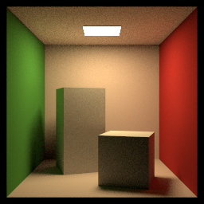

# Dacquoise 



**Dacquoise** is an offline physically-based renderer written in **Rust**.  

## Proposed Functions

- Rendering pipeline.  
- Editor based on QT.
- Multiple Monte Carlo methods.
- Standardized sampling APIs.  
- Material modeling methods.  

## Build

Prerequisites:
- Rust toolchain (stable), install via `rustup`

Build:
```
cargo build
```

Run tests:
```
cargo test
```

Render a scene:
```
cargo run --release --bin dacquoise -- scenes/cbox.xml output/cbox.exr --spp 128 --max-depth 3
```
