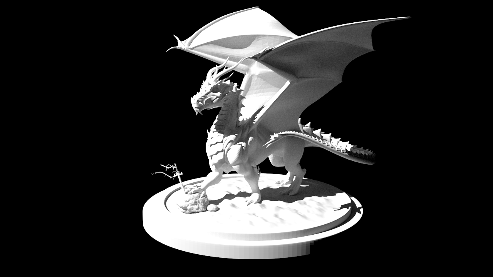
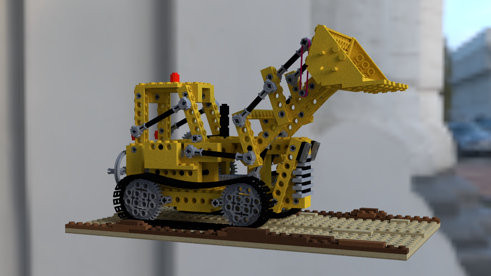
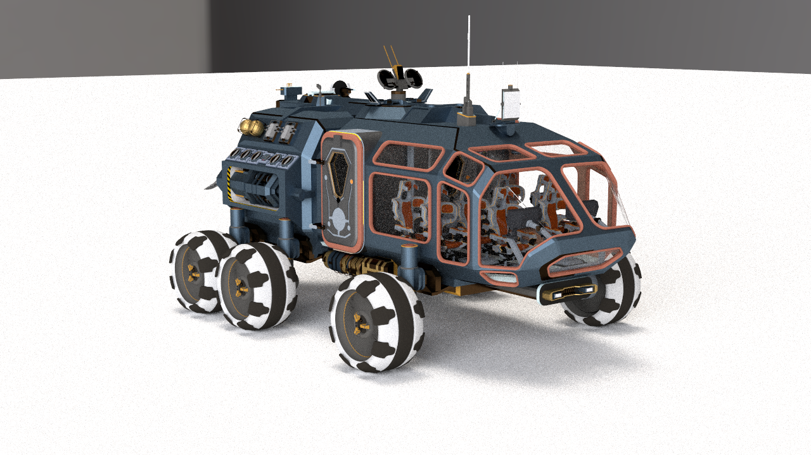

# Dacquoise 


**Dacquoise** is a compact offline renderer focused on physically-based path tracing in Rust.  
It targets clarity and extensibility for research and learning, while remaining practical for rendering real scenes.  

## Features

Emitters:
- Area
- Directional
- Environment map

Materials:
- Lambertian diffuse
- Rough conductor (GGX/Beckmann microfacet)
- Rough dielectric (GGX/Beckmann microfacet)
- Blend BSDF
- Two-sided wrapper

Integrators:
- Path tracer

## Build

Prerequisites:
- Rust toolchain (stable), install via `rustup`

Build:
```
cargo build
```

Run tests:
```
cargo test
```

Render a scene:
```
cargo run --release --bin dacquoise -- scenes/cbox/cbox.xml output/cbox.exr --spp 128 --max-depth 3
```

## Rendering

Use the CLI to render a scene file:
```
cargo run --release --bin dacquoise -- <scene.xml> <output.exr> --spp <samples> --max-depth <depth>
```

Sample scenes download [link](https://drive.google.com/drive/folders/1CVsNjM_GvmVP8oyHzRgteWlzTVGmjJnl?usp=sharing).

## Gallery






